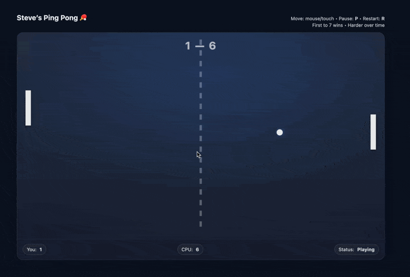

<p align="center">
  <a href="https://stephen-costa20.github.io/StevePingPong/"></a>
  <a href="https://stephen-costa20.github.io/StevePingPong/blob/main/LICENSE"></a>
  <a href="https://stephen-costa20.github.io/StevePingPong/commits/main"></a>
  
</p>

# ⭐ Ping Pong 🏓

A browser-based Ping Pong game built with **HTML, CSS, and vanilla JavaScript**. Play against a fast, responsive CPU directly in your browser — no build tools, installs, or dependencies required.

🎮 **Play the live demo:**  
https://stephen-costa20.github.io/StevePingPong/

<a href="https://stephen-costa20.github.io/StevePingPong/" target="_blank">
  
</a>

## Game Overview

This is a lightweight implementation of classic Ping Pong (table tennis) using an **HTML5 Canvas** render loop and simple physics.

When the page loads, you’ll get a **mode select screen**:

- **Easy Mode**: one ball, steady “normal” pace
- **Hard Mode**: multi-ball chaos that escalates each round

First player to **7** points wins.

## Modes

### Easy Mode
A clean, classic experience:
- **1 ball**
- Speed ramps gradually during rallies (per paddle hit)
- Great for quick play or as a simple learning reference

### Hard Mode
Designed to be stressful (in a good way):
- **Round-based multi-ball**: the number of balls increases as the match progresses  
  - Round 1 = 1 ball  
  - Round 2 = 2 balls  
  - Round 3 = 3 balls  
  - …and so on
- **Higher overall intensity**: faster CPU tracking and more chaotic ball trajectories
- Each new point respawns the balls for the next round

## Features

- 🏓 **Single-player gameplay** against a CPU opponent  
- 🎛️ **Mode selection**: Easy vs Hard  
- 🌀 **Hard mode scaling**: multi-ball rounds with increasing difficulty  
- 🎯 **Smooth paddle movement** with real-time collision detection  
- 📊 **Score tracking** with win condition (first to 7)  
- 🖱️ **Mouse and touch controls**  
- ⏸️ **Pause + restart** hotkeys  
- ⚡ **Runs entirely in the browser** (no backend)

## Controls

- **Move paddle:** Mouse or touch
- **Pause game:** `P`
- **Restart match:** `R`

> Tip: Your cursor is hidden over the game canvas for a cleaner arcade feel.

## Running Locally

### Option 1: Open directly
Clone the repo and open the HTML file:

```bash
git clone https://github.com/stephen-costa20/StevePingPong.git
cd pingpong
open index.html
```

Most browsers will run the game immediately.

### Option 2: Run a local server (recommended)

Some browsers restrict behavior when opening local files directly. If that happens, start a simple local server:

```bash
python -m http.server 8000
```

Then open:
```
http://localhost:8000
```

## Project Structure

```
pingpong/
├─ index.html
├─ README.md
└─ assets/
   └─ pingpong-preview.gif
```

No frameworks, no bundlers, no build step.

## Built With

- HTML5 Canvas
- Vanilla JavaScript

## Live Demo (GitHub Pages)

This project is deployed using GitHub Pages and is available here:

https://stephen-costa20.github.io/StevePingPong/
